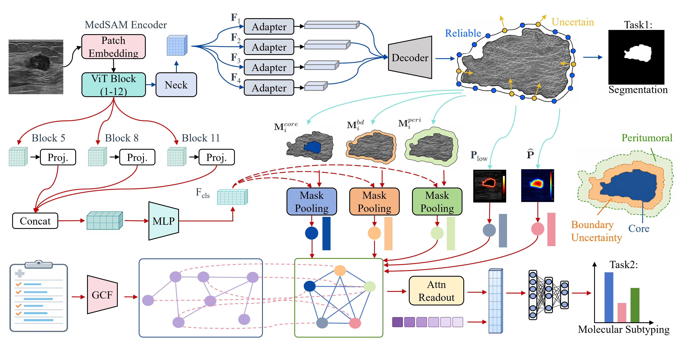

# BUA-LEL

**Boundary-Uncertainty-Aware Lesion Evidence Learning for Breast Ultrasound Segmentation and Multimodal Classification**

PyTorch implementation of BUA-LEL for joint lesion segmentation and multimodal classification.

[Quick start](doc/quickstart.md) · [Data preparation](doc/data.md) · [Experimental protocols](doc/experiments.md) · [Baseline methods](doc/baselines.md) · [Model implementation](doc/model.md)



## Method

BUA-LEL organizes segmentation-derived spatial information into structured lesion evidence for multimodal classification:

1. **Lesion-prior-aware semantic feature encoding:** a MedSAM ViT-B encoder supplies segmentation features and classification features from Transformer blocks 5, 8, and 11.
2. **Uncertainty-calibrated margin geometry encoding:** an anchor-constrained boundary graph uses probability-derived ambiguity and ring-structured message passing. Its context refines the dense lesion prediction; geometry and ambiguity embeddings provide classification evidence.
3. **Scale-adaptive zonal morphology encoding:** the refined lesion prior defines core, boundary, and peritumoral regions for masked statistical pooling.
4. **Morphology–clinical heterogeneous graph reasoning:** regional morphology, boundary evidence, and clinical representations interact before task-specific classification.

The implementation includes joint training, image-only segmentation, component/modality/fusion/backbone ablations, ROI sensitivity, calibration, paired statistical comparisons, and evidence visualization.

## Installation

Use Python 3.10 or newer. Install matching PyTorch and torchvision builds for your accelerator, then:

```bash
git clone https://github.com/JinlinYY/BUA-LEL.git
cd BUA-LEL
python -m pip install -r requirements.txt
python -m pip install -e . --no-deps
```

The manuscript specifies Python 3.10, PyTorch 2.0.1, CUDA 11.8, and an RTX 3090. For that stack, install `torch==2.0.1` and `torchvision==0.15.2` from the CUDA 11.8 PyTorch index and use `numpy<2`, `pandas<2`, and `opencv-contrib-python-headless<4.12`. The included single-task and nested baseline runners also support newer PyTorch versions; see [validation](doc/validation.md) for the environment actually checked for this repository.

Acquire the MedSAM ViT-B pretrained weights from the [MedSAM project](https://github.com/bowang-lab/MedSAM) and place them at `checkpoints/medsam_vit_b.pth`, or set `medsam_checkpoint_path` in your YAML configuration. Dataset files and pretrained/trained weights are **not distributed**.

## Data and tasks

| Dataset | Inputs | Task |
|---|---|---|
| HER2USC | Ultrasound + clinicopathological variables | Segmentation + HER2-zero / HER2-low / HER2-positive |
| LMNUSC | Ultrasound + clinical variables | Segmentation + LN0 / LN1–3 / LN≥4 |
| BrEaST | Ultrasound + BI-RADS descriptors | Segmentation + non-malignant / malignant |
| BUSI | Ultrasound only | Lesion segmentation |
| IMA++ | Dermoscopy + structured metadata | Segmentation + binary or three-class diagnosis |
| ISIC2018 | Dermoscopy only | Additional segmentation configuration |

**Dataset naming:** the cross-domain experiment labeled “ISIC2018” in the manuscript uses **IMA++**. Use `configs/imaplusplus.yaml` or `configs/imaplusplus_multiclass.yaml` for that data. `configs/isic2018.yaml` is a separate segmentation configuration and does not reproduce the manuscript's image–tabular result.

See [data.md](doc/data.md) for schemas, label mappings, patient grouping, and exclusion of outcome-revealing variables. Private clinical cohorts and their patient split manifests are not included.

## Training and inference

Run commands from the repository root. Relative paths in YAML files are interpreted from that directory.

```bash
# Inspect the complete configuration without accessing data or weights.
python scripts/cross_validate.py --config configs/her2usc.yaml --dry-run

# Run all five folds, or use --fold 1 for a single selected fold.
python scripts/cross_validate.py --config configs/her2usc.yaml
python scripts/train.py --config configs/breast.yaml --fold 1

# Predict one image using a trained fold's clinical preprocessing.
python scripts/inference.py --checkpoint outputs/HER2USC/bua_lel/best_fold1.pth \
  --image data/HER2USC/images/example.png \
  --clinical-json /path/to/clinical_variables.json \
  --output-dir outputs/prediction --device cuda
```

`clinical_variables.json` contains raw feature names and values, without a diagnosis label. Image-only checkpoints do not require it. Inference reconstructs the architecture and clinical transformations from the trained checkpoint; the original pretrained checkpoint is not needed at inference time. Load only checkpoints from trusted sources.

Training writes fold checkpoints, case predictions, per-fold metrics, and cross-fold summaries beneath `outputs/`. [Evaluation and analysis commands](doc/experiments.md) cover held-out evaluation and each experiment family.

**Protocol scope:** dataset YAML files are runnable research configurations, not a claim that every manuscript table value has been independently reproduced. The primary trainer supports fold-validation checkpoint selection and fixed-final-epoch evaluation. The nested baseline runner keeps a separate inner validation partition. These protocols must not be pooled into an unqualified comparison. See [the precise distinctions](doc/experiments.md).

## Repository

```text
BUA-LEL/
├── README.md, LICENSE, CITATION.cff, requirements.txt
├── doc/                    # Data, method, protocols, baseline provenance
├── assets/                 # Method illustration
├── configs/                # Dataset and ablation configurations
├── bua_lel/
│   ├── data/               # Matched image/clinical data and fold preprocessing
│   ├── models/             # BUA-LEL and MedSAM-MTL
│   │   ├── backbones/
│   │   ├── boundary/
│   │   ├── morphology/
│   │   ├── clinical/
│   │   ├── fusion/
│   │   └── heads/
│   ├── engine/             # Objectives, training, evaluation, inference
│   ├── experiments/        # Ablation definitions
│   └── utils/              # Metrics, calibration, optimization, seeding
├── baselines/              # Segmentation, classification, multi-task methods
├── scripts/                # Data preparation, training, evaluation, inference
├── analysis/               # Calibration, sensitivity, statistics, efficiency
├── tests/                  # Synthetic-data methodological checks
├── third_party/segment_anything/
├── data/README.md
└── checkpoints/README.md
```

## Citation and license

Use [CITATION.cff](CITATION.cff) to cite the software and cite the accompanying manuscript by its title above. Publication identifiers will be added when available.

BUA-LEL code is released under the [MIT License](LICENSE). Segment Anything retains Apache-2.0; see [third-party notices](THIRD_PARTY_NOTICES.md). Dataset and model-weight licenses remain with their respective providers.
